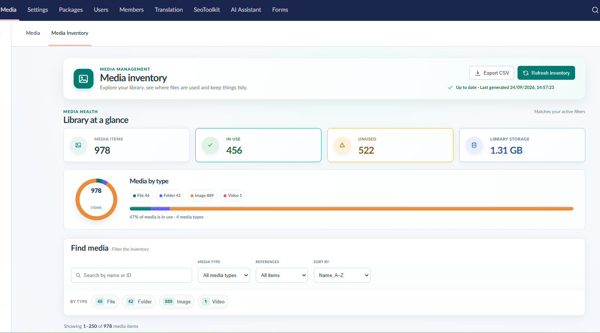

# Umbraco Media Inventory Report

Umbraco Media Inventory Report adds a dashboard to the **Media** section of the Umbraco backoffice. It gives administrators a clear view of the media library: what is stored, where assets are used, how much storage they consume, and which items may be safe to clean up.

The package is built for Umbraco 17 and .NET 10 as a Razor Class Library. It uses Umbraco's media and reference-tracking services; no database queries, template changes, or manual dashboard registration are required.



## Why use this package?

Large media libraries are easy to accumulate and difficult to audit. This dashboard brings the information needed for routine cleanup into one place.

- Browse media items with their type, URL, upload date, file size, and reference state.
- See at-a-glance totals for media items, items in use, unused items, storage consumption, and media types.
- Search by name or ID, and filter by media type and whether an item has references.
- Sort by name, type, reference count, or upload date.
- Expand an item to inspect the content that references it and open that content directly.
- Export the current filtered inventory to CSV.
- Refresh the cached inventory in the background, with progress shown in the dashboard.
- Move unused items to Umbraco's recycle bin from the report.

## Requirements

- Umbraco CMS 17
- .NET 10

## Installation

Install the package in the Umbraco web project:

```bash
dotnet add package MediaInventory.Report.Umbraco
```

Restart the application, then open **Media** in the Umbraco backoffice and select **Media Inventory**. The dashboard is registered automatically.

## Using the dashboard

The dashboard begins with a media-health summary. It shows the total number of media items, how many are in use or unused, total library storage, and a breakdown by media type.

Use the filters to narrow the report:

| Filter | Purpose |
| --- | --- |
| Search | Finds media by name or numeric ID. |
| Media type | Limits the report to images, files, folders, video, or audio. |
| References | Shows all items, only items in use, or only items not in use. |
| Sort by | Orders the results by name, type, references, newest upload, or oldest upload. |

Select the chevron beside a media item to view its tracked references. The CSV export respects the active search, type, reference, and sort filters.

## Refreshing the inventory

The report stores a media-inventory snapshot in memory for up to seven days, with a 12-hour sliding cache window. Choose **Refresh inventory** whenever you need a current view.

Refreshing runs in the background so the dashboard remains responsive. The status area reports progress while the package scans media in bounded batches, then replaces the cached snapshot only when the refresh completes successfully. If a refresh fails, the previous cache remains available.

## Removing unused media

The trash action is only offered for items reported as **Not in use**. It uses Umbraco's supported recycle-bin operation, rather than changing CMS data directly.

Before removing an asset, review the dashboard's reference details and consider references that are not tracked by Umbraco, such as hard-coded URLs in templates, stylesheets, integrations, or external systems. Moving an item to the recycle bin is reversible from Umbraco's recycle bin.

## Security

All package API endpoints require an authenticated Umbraco backoffice user. The dashboard is intended for users who already have appropriate media-management access in the host Umbraco installation.

## How it works

The package registers an Umbraco composer and a Media-section dashboard. The dashboard calls authenticated management endpoints to:

1. Build or retrieve a cached inventory of non-trashed media.
2. Identify referenced assets through Umbraco's tracked-reference service.
3. Return paged, filtered, and sorted results to the backoffice UI.
4. Start and monitor background refreshes.
5. Export the selected inventory view as CSV.
6. Move an unused media item to Umbraco's recycle bin on request.

## Build and package locally

From the repository root:

```bash
dotnet restore "Umbraco.MediaInventory.Report.slnx"
dotnet build "Umbraco.MediaInventory.Report.slnx" --configuration Release
dotnet pack "Umbraco.MediaInventory.Report/Umbraco.MediaInventory.Report.csproj" --configuration Release
```

To rebuild the backoffice client during development:

```bash
cd Umbraco.MediaInventory.Report/Client
npm install
npm run build
```

The client build writes its output to `wwwroot/App_Plugins/UmbracoMediaInventoryReport/`.

## Contributing

Issues and pull requests are welcome. Please keep changes focused, preserve the backoffice authentication requirement, and update this README when package behavior changes.

## License

This project is licensed under the MIT License.
